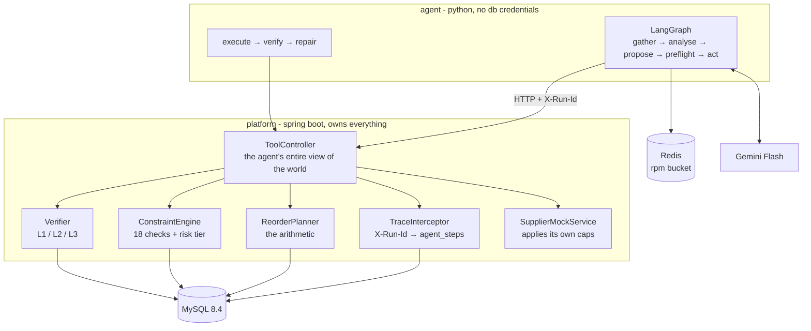

# AI Purchasing Agent

An agent that reviews a purchasing situation, works out what should actually be bought, does it, and then checks whether what happened matches what it intended.

The brief's sharpest line is *"the goal is not to build a chatbot that answers purchasing questions"*, so the design starts from a single rule:

> **The model decides what to investigate and how to explain it. It never does the arithmetic and it never decides what it is allowed to do.**

Quantities come from tested Java. Permission comes from a deterministic constraint engine. The agent runs in a separate process with **no database credentials** — every fact it reads and every action it takes is an HTTP call into the platform, which validates independently each time. The guardrail is a service boundary, not a sentence in a prompt.

---

## Quickstart

```bash
git clone https://github.com/a-ditya1910/rappi-ai-purchasing-agent.git
cd rappi-ai-purchasing-agent
cp .env.example .env          # paste a free Gemini key, see below
docker compose up              # mysql, redis, platform, agent, web
```

Then open **http://localhost:5173**. Flyway migrates and seeds on first boot.

For development with hot reload, run the two services yourself instead:

```bash
docker compose up -d mysql redis
cd platform && ./mvnw spring-boot:run          # :8080
cd agent && pip install -r requirements.txt && uvicorn main:app --port 8100
cd web && npm install && npm run dev           # :5173
```

A Gemini key is free and needs no credit card: **https://aistudio.google.com/apikey**

**The evaluation suite needs no key at all** — it replays recorded runs:

```bash
python evals/run_evals.py
```

### One run, end to end

```bash
# 1. open a run
RUN=$(curl -s -XPOST localhost:8080/runs -H 'Content-Type: application/json' \
  -d '{"scenario":"S1_REVIEW","sku":"SKU-MILK-1L","nodeId":"NODE-BOG-01",
       "supplierId":"SUP-LACTEO","recommendedQty":800}' | jq -r .runId)

# 2. let the agent decide
curl -s -XPOST localhost:8100/decide -H 'Content-Type: application/json' \
  -d "{\"run_id\":\"$RUN\",\"scenario\":\"S1_REVIEW\",\"sku\":\"SKU-MILK-1L\",
       \"node_id\":\"NODE-BOG-01\",\"supplier_id\":\"SUP-LACTEO\",\"recommended_qty\":800}"

# 3. see what is waiting for a buyer, and approve it
curl -s localhost:8080/approvals
curl -s -XPOST localhost:8080/approvals/<id>/decide -H 'Content-Type: application/json' \
  -d '{"decision":"approve","decidedBy":"buyer:ana","note":"agreed"}'
```

### The console

Three screens at **http://localhost:5173**:

**Scenario console** — the situation a buyer would be looking at (position broken into its parts, forecast, budget, open POs, demand verdict), then what the agent did about it: the quantity derivation quoted from the planner, the reasoning, the constraint checks that did not pass, and what it took on faith.

The recommended quantity is **editable**. Type 50000 and watch it refuse — that says more about the system than any amount of prose.

**Approval queue** — the T3 decisions waiting on a human, each with the specific check that made it their call. Approving hands it back to the agent, which then runs the same execute-and-verify path an auto-approved action takes. Rejecting requires a note, because that note is the only feedback the agent gets.

**Run trace** — every step, written by the platform's interceptor rather than by the agent.

---

## Architecture



**Two services, and the split is the point.** Python is used exactly where AI needs it — LangGraph and the Gemini SDK. Everything else is Java. The agent cannot reach the database, so it cannot skip validation.

**The trace comes free.** Every agent tool call is an HTTP request carrying `X-Run-Id`, so a single Spring `HandlerInterceptor` writes the whole audit trail. The agent contains no tracing code. That one class powers the audit log, the eval suite's tool-coverage assertions, and the latency numbers.

---

## How decisions are made

`ReorderPlanner` is a `@Service` that runs in one read-only transaction, so inventory, open POs and forecast all come from a single consistent snapshot.

```
Protection period = 5 lead time + 7 review period = 12 days
Position = 320 on hand - 40 reserved + 400 arriving within 12 days = 680
Expected demand over 12 days = 689.7 units (mean 57.5/day)
Safety stock = 2.05 z x sqrt(12 x 12.0^2 + (57.5 x 1.0)^2) = 146 units
Target position = 836, current 680, so raw need = 156
Need 156 is below the 200 minimum order quantity
Rounded up to 204 to fit case pack of 12
```

**204, not 800.** The 400 units already arriving on Friday are the whole difference — someone saw 320 on the shelf and panicked.

Two details that matter:

- **Protection period is lead time *plus* review period.** Using lead time alone is the classic under-ordering bug: you must survive until the *next* chance to order, not just until this delivery lands.
- **Safety stock carries two variance terms** — demand wobbles day to day, *and* the supplier's lead time wobbles. Dropping the second under-buffers unreliable suppliers.

Those `explanationSteps` are returned to the agent, which quotes them. That is what stops the model inventing numbers.

---

## How decisions are validated

This is the part the brief cares most about, so it gets the most room.

**The principle: never trust the return value of your own write.** An agent that calls `create-po`, gets `ok` back and reports success has validated nothing — it has read its own optimism.

| Level | Question | Mechanism |
|---|---|---|
| **L1** | Did the write land as written? | `em.clear()` then re-read from MySQL, diff against intent |
| **L2** | Is the resulting world still legal? | Constraint engine on **post-state**, in a `REQUIRES_NEW` transaction |
| **L3** | Did it achieve the goal? | Walk the shelf day by day, count days it goes negative |

Two implementation details carry real weight:

- **`em.clear()`** — without it JPA hands back the same in-memory object you just saved, so the "re-read" compares an object with itself.
- **`REQUIRES_NEW`** — without it, verification runs inside the writing transaction and reads its own uncommitted rows. Every check would pass and none would mean anything.

### A real run

The supplier was capped at 120 against an order of 240:

```
VERIFICATION            INTENDED      ACTUAL       VERDICT
L1  qtyOrdered          240           240          ok
L1  qtyConfirmed        240           120          MISMATCH
L2  postStateLegal      no blocking   MOQ: 120 is below the 240 minimum   MISMATCH
L3  stockoutDays        0             2            MISMATCH
    still short: 2 days below zero from 2026-03-15
    2026-03-15: -50 demand -> position -28
    2026-03-16: +300 arrives, -42 demand -> position 230
```

Each level caught something the others could not. **L2 is the interesting one** — it noticed that the 120 units actually delivered are now *below the supplier's own minimum*, a violation the original order did not have. Nobody wrote a rule for "what if a partial delivery breaks a different constraint"; re-running the whole engine on the new state found it anyway.

In a separate approved run, L1 and L3 were both clean and **L2 alone** caught that the purchase pushed shelf-life cover to 1.58×, past the 1.50× limit — so the agent escalated instead of declaring victory.

### When verification fails

The repair step picks from a **closed set**: `amend`, `split`, `cancel_and_recreate`, `accept_as_is`, `escalate`. Anything else escalates. An agent that can invent its own recovery, with money already committed, is how you get a creative disaster.

`accept_as_is` is gated specifically on L3: if the shelf is still empty the goal was not met, and "close enough" is not on the menu. It is the option a model reaches for when it wants to be finished, so it has the strictest gate — and there is a test that tries it and asserts it gets overridden.

### The mismatches are real, not injected

`SupplierMockService` does not echo back what you send it. It caps quantity at what it can actually ship, slips delivery dates for unreliable suppliers, and occasionally confirms a different price. `SUP-ANDINA` can ship 250 coffee a day, so ordering 500 produces a shortfall without anyone arranging one.

---

## Autonomy and guardrails

| Tier | What | Who decides |
|---|---|---|
| T0/T1 | Reads, compute, notify, record | Nobody |
| **T2** | Value ≤ $1,000, all checks pass, existing supplier, qty within 50% of the recommendation | Agent — then always verified |
| **T3** | Anything else | A human, via the approval queue |

```java
String tier = (!blocking.isEmpty() || hasApproval || overValue || !supplier.isActive())
        ? "T3" : "T2";
```

Computed in Java. The model's opinion of its own authority is never consulted — a model asked *"are you allowed to do this?"* will eventually answer yes.

**Approval is a resume, not a second code path.** The buyer approves, the platform hands the action back to the agent, and it runs the same execute-and-verify path an auto-approved action takes. One code path, so a human-approved purchase gets checked exactly as carefully.

Other guardrails: Bean Validation rejects hallucinated arguments before any logic runs; a `UNIQUE` idempotency key makes a retried write return the original order; JPA `@Version` stops the agent clobbering a buyer's concurrent edit; gather and repair are both capped; untraced writes are refused outright.

---

## Scenarios

**Scenario 1 — recommendation review (end to end).** 800 recommended → **204**, tier T3, queued for a buyer, approved, executed, verified. Accepting is wrong and rejecting is also wrong; the right answer needs five separate facts.

**Scenario 2 — supplier cannot fulfil.** Covered by the verification and repair loop above. The supplier mock produces the shortfall naturally.

**Scenario 3 — demand changed.** Two SKUs that look identical on a chart:

| | Chips | Soda |
|---|---|---|
| Verdict | **REAL** | **EXPLAINED** |
| Tracking signal | 54.92 | 31.48 |
| Sustained days | 14 ≥ 7 | 3 < 7 |
| Promotion | none | PROMO-114 |

**Both tracking signals are far over the limit of 4**, so that statistic alone would call both real. The run length and the promo calendar are what separate them — which is why the verdict is a compound condition, not a threshold.

This deliberately does **not** use a z-score. A z-score is not robust: the soda series carries one 1,070-unit B2B order that inflates the mean and the standard deviation together, so the ratio shrinks and the outlier hides behind the damage it caused.

**Scenario 4 — constraint.** Rice needs 713 units, the budget affords 140, and the only supplier's minimum is 1,000. **No legal purchase exists**, so the agent orders nothing and says why.

---

## Evaluation

```
python evals/run_evals.py            # replay, no api key needed
python evals/run_evals.py --live     # re-record against the real model
```

**28 of 29 checks pass across 6 cases.**

```
BY DIMENSION
  decision class           6/6
  constraint integrity     4/4     <- no run ever produced an illegal state
  tool coverage            4/4
  quantity band            5/5
  anomaly verdict          2/2
  prose does not double count 0/1  <- deliberate, see below
```

Assertions are about **properties, not answer text** — a correct answer reached by luck is not a working agent. So: did it look things up, did it respect the constraints, did it do something legal, did it verify.

### The failing check stays failing

The model wrote *"the current position (680) plus the existing in-transit order (400)"* — but the 400 is already **inside** the 680. The prose double-counts.

The number is still right, because it came from `ReorderPlanner`. That is the three-layer split demonstrated by a real defect instead of claimed in a README, and a green suite that hid it would be worth less.

### One case changed my mind

`s3_real_demand_shift` expected `MODIFY`. The agent said `INVESTIGATE` and explained that the forecast was 136 hours stale at 44/day against actuals of 102/day — so the planner's quantity was built on a number it had good reason to distrust. That is better judgement than I asked for, so the expectation changed rather than the agent.

### Why replay

The Gemini free tier's per-day quota is roughly **32 requests**, measured, not the 1,500 I first assumed. A 16-case × 3-run suite would be ten days of quota. So each case is recorded live once and committed, and the suite replays.

Replay proves the assertions and the pipeline are real and lets anyone re-run them for free. It does **not** prove the model behaves identically today — `--live` does that, quota permitting. Both are worth claiming and they are different claims.

---

## Known gaps

Stated plainly rather than left to be discovered.

| Gap | Detail |
|---|---|
| **No forecast override** | The agent correctly detects a stale, wrong forecast and correctly refuses to act on the resulting number — but has no way to recompute with an observed rate. The fix is a `demandOverride` parameter on `calculate-reorder`. Scoped out rather than half-built. |
| **Retrieval is term overlap, not embeddings** | Seven policy documents. Cosine over embeddings is a 15-line swap behind the same interface. Knowing where the threshold sits matters more than reaching for a vector store. |
| **Single currency, single region** | No FX. |
| **No auth** | One buyer identity. Not graded, and it would cost an hour. |

## Deliberate choices worth defending

**Java 17 / Spring Boot 3.5.3** — Boot 4.x is not published to Maven Central; the parent POM will not resolve. Verified rather than assumed.

**`ddl-auto: validate`, not `update`** — Flyway owns the schema. `validate` rejected the boot twice during development over real drift that `update` would have silently papered over by creating a second set of tables.

**`open-in-view: false`** — this caught a genuine bug: `/tools/open-pos` was returning HTTP 500 on every call from lazy-loading outside a transaction. The agent never saw open POs and *still* produced the right answer, because the planner does that maths server-side. A broken tool was masked by the deterministic layer.

**Gemini over Claude** — the JD names Claude, and the provider is one adapter file. Gemini's free tier means a reviewer can run this whole repo end to end without a credit card. A take-home nobody can execute gets skimmed.

**No Redis for idempotency** — the uniqueness check has to commit in the same transaction as the PO insert, so it is a MySQL `UNIQUE` index. Redis holds the rate-limit bucket, where shared state across processes is the actual requirement.

## What I would do next

1. The forecast override, closing Scenario 3 end to end.
2. Feed received quantities back into `suppliers.reliability_score`, so the alternate-supplier ranking learns from what actually arrived.
3. Batch mode: run the deterministic planner nightly across every SKU and invoke the model only on the exceptions. At 50,000 SKUs that is the only cost model that works, and it is why the maths is separable from the agent.

## Layout

```
platform/   spring boot - mysql, planner, constraint engine, tools, verifier
agent/      python - langgraph, gemini adapter, repair loop
web/        react - scenario console, approval queue, run trace
evals/      cases.json, run_evals.py, recorded/
```

Tests: `cd platform && ./mvnw test` (34 unit) · `cd agent && pytest` (15) · integration tests need `docker compose up`.
